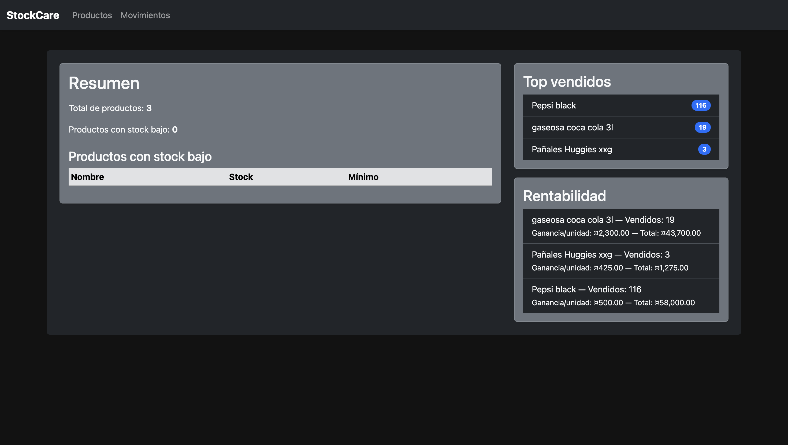
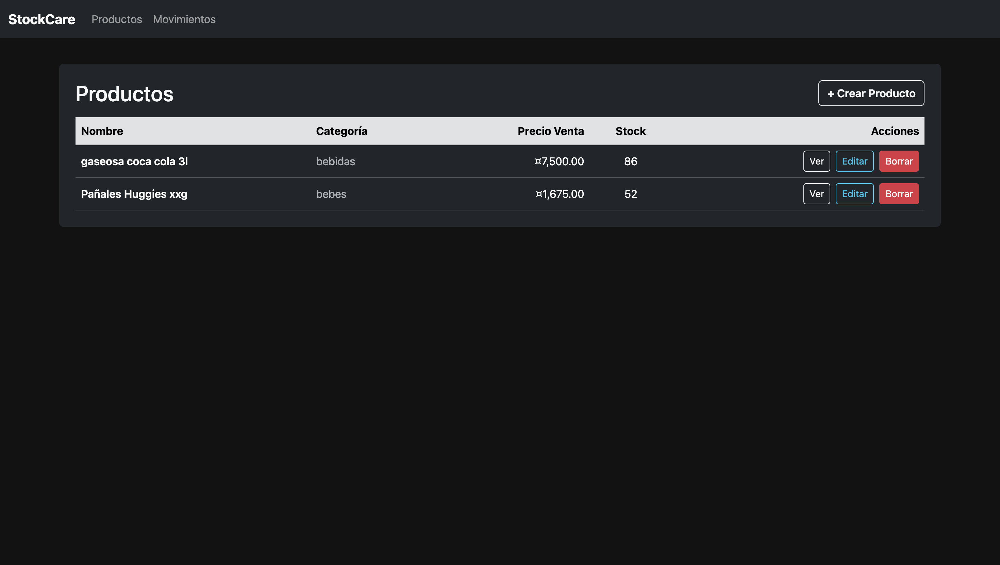
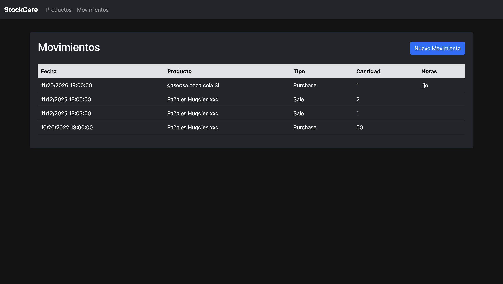

Excelente 🔥
Con toda la información confirmada, acá tienes el **README.md completo, profesional y con formato GitHub-ready** para tu aplicación **StockCare**.
Incluye badges de estado, versión y licencia, descripción detallada, guía de instalación, uso, arquitectura, y un **diagrama Mermaid** de base de datos con productos, movimientos, ventas, compras y rentabilidad.

---

````markdown
# 🧾 StockCare

[](https://github.com/CristopherB14/StockCare)
[](https://github.com/CristopherB14/StockCare/releases)
[](LICENSE)

**StockCare** es una aplicación desarrollada en **C# + ASP.NET Core MVC (.NET 8)** que permite gestionar el **stock de productos**, **ventas**, **compras** y **movimientos de inventario** en tiempo real.  
Incluye funcionalidades de **alertas de bajo stock**, **registro de rentabilidad por producto**, y un sistema de **seguimiento histórico de operaciones** para facilitar la toma de decisiones.

---

## 🚀 Características principales

- ✅ CRUD completo de **productos**, **ventas** y **compras**  
- 📦 Control de **entradas y salidas** de stock  
- 💰 Cálculo automático de **rentabilidad por producto**  
- ⚠️ **Alertas** automáticas por niveles bajos de stock  
- 📊 **Reportes e historial** de movimientos  
- 🧮 Soporte para operaciones de venta y compra con detalles por ítem  
- 🧱 Interfaz moderna basada en **Bootstrap 5**  
- 🗄️ Base de datos **SQLite embebida** (sin ORM)

---

## 🧩 Arquitectura y tecnologías

| Componente | Tecnología |
|-------------|-------------|
| Lenguaje | C# |
| Framework | ASP.NET Core MVC (.NET 8) |
| Base de Datos | SQLite embebida |
| Frontend | Bootstrap 5 |
| Patrón | MVC |
| ORM | No utiliza (acceso directo a SQLite) |

---

## ⚙️ Instalación y ejecución

1. **Clonar el repositorio**
   ```bash
   git clone https://github.com/CristopherB14/StockCare.git
   cd StockCare
````

2. **Ejecutar la aplicación**

   ```bash
   dotnet run
   ```

3. **Acceder desde el navegador**

   ```
   http://localhost:<puerto>
   ```

> 🔹 *El puerto se mostrará en la consola al ejecutar la aplicación.*

---

## 🧱 Estructura de la base de datos

El siguiente diagrama representa la estructura general del sistema de gestión de stock y rentabilidad.

```mermaid
erDiagram

    PRODUCTO {
        int Id
        string Nombre
        string Descripcion
        decimal PrecioCompra
        decimal PrecioVenta
        int StockActual
        int StockMinimo
        datetime FechaCreacion
    }

    MOVIMIENTO {
        int Id
        int ProductoId
        string Tipo  // Entrada o Salida
        int Cantidad
        datetime Fecha
        string Motivo
    }

    VENTA {
        int Id
        datetime Fecha
        decimal Total
    }

    DETALLEVENTA {
        int Id
        int VentaId
        int ProductoId
        int Cantidad
        decimal PrecioUnitario
        decimal Subtotal
    }

    COMPRA {
        int Id
        datetime Fecha
        decimal Total
    }

    DETALLECOMPRA {
        int Id
        int CompraId
        int ProductoId
        int Cantidad
        decimal PrecioUnitario
        decimal Subtotal
    }

    RENTABILIDAD {
        int Id
        int ProductoId
        decimal TotalIngresos
        decimal TotalCostos
        decimal Margen
        datetime FechaCalculo
    }

    PRODUCTO ||--o{ MOVIMIENTO : "registra"
    PRODUCTO ||--o{ DETALLEVENTA : "incluye"
    PRODUCTO ||--o{ DETALLECOMPRA : "incluye"
    VENTA ||--o{ DETALLEVENTA : "contiene"
    COMPRA ||--o{ DETALLECOMPRA : "contiene"
    PRODUCTO ||--o{ RENTABILIDAD : "calcula"
```

---

## 🖼️ Capturas de pantalla

> *(Reemplazá estas imágenes por tus propias capturas reales del sistema)*





---

## 📚 Uso general

1. Crear los productos con su precio de compra, venta y stock inicial.
2. Registrar compras para aumentar el stock.
3. Registrar ventas para disminuir el stock.
4. Consultar el módulo de **movimientos** para revisar entradas y salidas.
5. Acceder al módulo de **rentabilidad** para visualizar ganancias por producto.
6. Recibir alertas cuando el stock cae por debajo del mínimo configurado.

---

## 🧠 Filosofía del proyecto

StockCare busca ofrecer una herramienta **simple pero potente** para la gestión de inventarios pequeños y medianos, priorizando la **claridad visual** y la **trazabilidad completa** de cada producto.

---

## 🤝 Contribuir

Las contribuciones son bienvenidas 🙌
Si querés colaborar:

1. Realizá un fork del repositorio.
2. Creá una rama con tu mejora:

   ```bash
   git checkout -b feature/nueva-funcionalidad
   ```
3. Enviá un Pull Request con una descripción clara del cambio.

También podés abrir un **Issue** en [GitHub Issues](https://github.com/CristopherB14/StockCare/issues) para reportar errores o proponer mejoras.

---

## 📄 Licencia

Este proyecto está bajo la **[Licencia MIT](LICENSE)**.
Podés usarlo, modificarlo y distribuirlo libremente, siempre que mantengas los créditos correspondientes.

---

## 📎 Enlaces útiles

* 🔗 [Repositorio en GitHub](https://github.com/CristopherB14/StockCare)
* 📘 [Documentación de .NET 8](https://learn.microsoft.com/dotnet/)
* 🎨 [Bootstrap](https://getbootstrap.com/)
* 🧮 [SQLite](https://www.sqlite.org/index.html)

---

⭐ **Si te resulta útil, no olvides dejar una estrella en el repositorio.**

```

---

¿Querés que te genere también el archivo `LICENSE` con el texto oficial de **MIT** para incluirlo directamente en tu repo?
```
